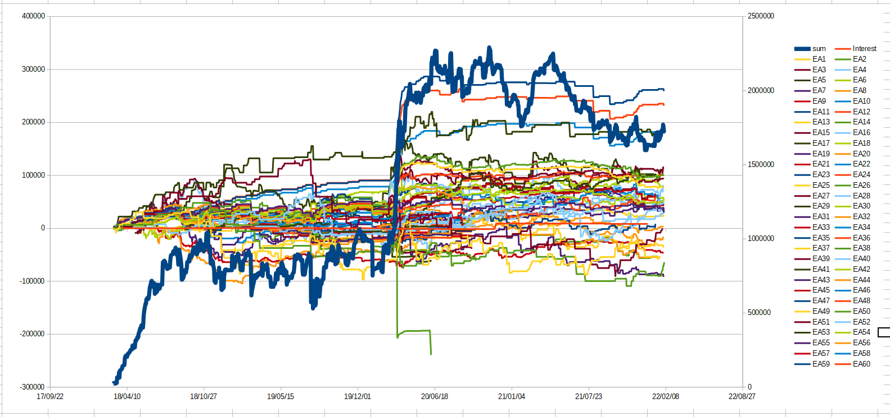
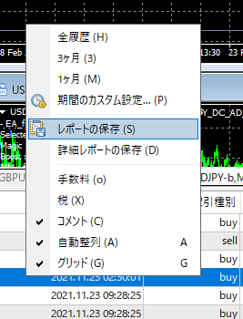
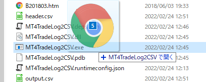
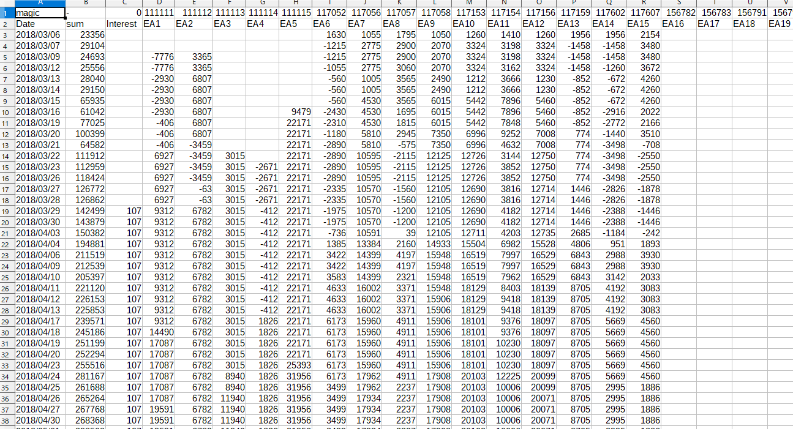

# MT4TradeLog2CSV

MT4のTradeLog(レポート)をEAのmagicごとに集計して、CSVに出力します。  
簡単にグラフ作れます。  

## Demo
 

# Usage
- 1.MT4でレポートの保存をします。  
  
- 2.ドラッグ・アンド・ドロップで起動します。  
  
- 3.集計されoutput.csvが作成されます。  
  
- 4.ご愛用の表計算ソフトに貼り付けて使います。  
  
- 動作確認用のサンプルなど  
[レポートファイル](doc/sample.htm)  
[output](doc/output.csv)  
[グラフ作成.ods](doc/sample.ods)  

# Note
OANDA JAPANの口座で動作確認。  
スワップは他社口座では対応できない可能性大。  
基本自分用なので、細かいところは自身で修正して使ってください。  
要望があればいくらかは対応します。  
これまで、libreofficeでコピペ、コピペして作ってたけど、これで楽になります＾＾  

## Author
[Ito](https://github.com/Ito-coder)

